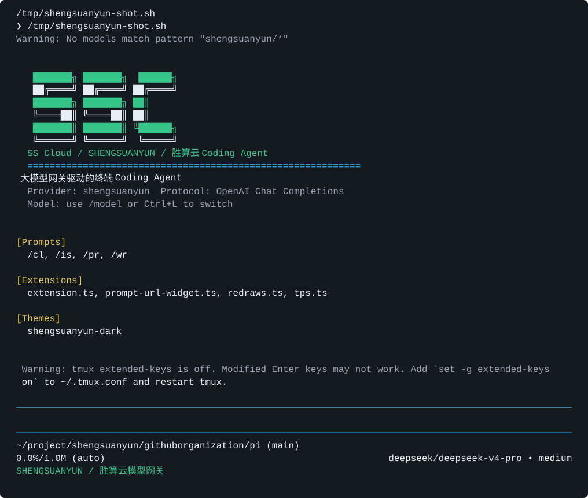
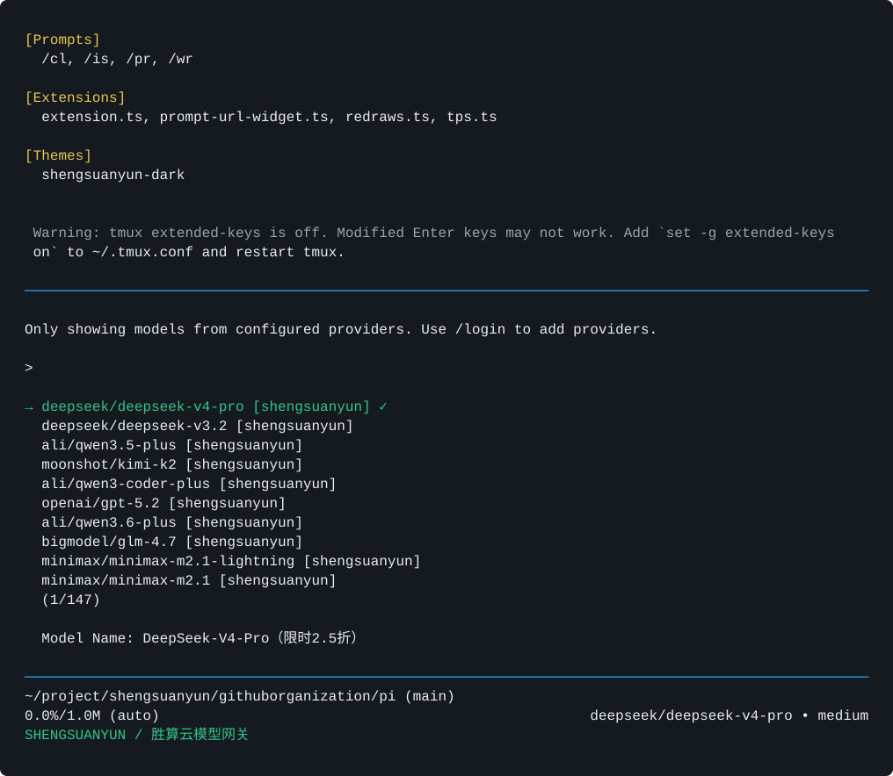

# 胜算云 Coding Agent

胜算云 Coding Agent 是胜算云基于 [Pi](https://pi.dev) 维护的 Coding Agent 发行版。这个仓库保留 Pi upstream 作为技术基座，同时增加胜算云自己的 CLI、模型 Provider、主题品牌和发布流程。

核心目标是让用户可以直接通过胜算云大模型网关使用多种代码模型，而不需要手动配置 Pi 的 provider、theme、extension 和模型范围。

```bash
npm install -g @cocovs/shengsuanyun-coding-agent@0.75.5-shengsuanyun.2
export SHENGSUANYUN_GATEWAY_API_KEY="..."
shengsuanyun-agent
```

## 我们做了什么

- 新增独立 npm 包：`@cocovs/shengsuanyun-coding-agent`
- 新增独立命令：`shengsuanyun-agent`
- 新增胜算云 Provider：默认接入 `https://router.shengsuanyun.com/api/v1`
- 默认模型改为：`deepseek/deepseek-v4-pro`
- 交互式 `/model` 默认只查看和切换胜算云模型，范围为 `shengsuanyun/**`
- 模型列表从胜算云网关动态获取，并过滤支持 `/chat/completions` 的模型
- 新增胜算云主题和 `SSC` 启动标识
- 新增 tag 驱动的 GitHub Actions 发布流程
- 建立 upstream rebase 策略：版本跟随官方 Pi，在同一 upstream 版本上补发胜算云修复时使用 `-shengsuanyun.N`

## 截图

启动页：



模型选择：



## 安装与使用

安装 CLI：

```bash
npm install -g @cocovs/shengsuanyun-coding-agent@0.75.5-shengsuanyun.2
```

建议先安装本地代码搜索工具，避免首次启动时由 Pi 自动下载失败：

```bash
brew install ripgrep fd
```

配置胜算云模型网关 API key：

```bash
export SHENGSUANYUN_GATEWAY_API_KEY="..."
```

启动交互式 Agent：

```bash
shengsuanyun-agent
```

非交互验证：

```bash
shengsuanyun-agent --print "只回复 OK"
```

切换默认模型：

```bash
SHENGSUANYUN_GATEWAY_MODEL=ali/qwen3-coder-plus shengsuanyun-agent
```

查看胜算云模型列表：

```bash
shengsuanyun-agent --list-models shengsuanyun
```

如果当前网络或代理环境无法访问模型列表接口，CLI 会使用内置的胜算云 fallback 模型列表。也可以显式指定 fallback 模型：

```bash
export SHENGSUANYUN_GATEWAY_MODELS="deepseek/deepseek-v4-pro=DeepSeek-V4-Pro,ali/qwen3.6-max-preview=Qwen3.6 Max"
```

## 默认行为

| 项目 | 默认值 |
| --- | --- |
| Provider | `shengsuanyun` |
| 模型 | `deepseek/deepseek-v4-pro` |
| 网关 | `https://router.shengsuanyun.com/api/v1` |
| 调用协议 | OpenAI Chat Completions |
| 调用路径 | `/chat/completions` |
| 模型列表 | `/models` |
| 交互式模型范围 | `shengsuanyun/**` |

## 环境变量

| 变量 | 说明 |
| --- | --- |
| `SHENGSUANYUN_GATEWAY_API_KEY` | 胜算云模型网关 API key |
| `SHENGSUANYUN_GATEWAY_BASE_URL` | 覆盖默认网关地址 |
| `SHENGSUANYUN_GATEWAY_MODEL` | 覆盖 CLI 默认启动模型 |
| `SHENGSUANYUN_GATEWAY_MODELS_URL` | 覆盖模型列表接口地址 |
| `SHENGSUANYUN_GATEWAY_MODELS` | 模型列表接口失败时的 fallback，格式为 `model-id=显示名,other-model` |

## 协议边界

当前胜算云 Provider 只接入 OpenAI Chat Completions 兼容协议。动态模型发现只注册 `support_apis` 包含 `/chat/completions` 的模型。

这个限制是有意保留的：Pi 的 `api` 决定请求体、流式响应解析、tool calling 格式和兼容性选项，不能只靠同一份模型列表安全混用不同协议。

后续多协议支持建议拆为独立 provider：

- `shengsuanyun-openai`：`/v1/chat/completions` -> `openai-completions`
- `shengsuanyun-responses`：`/v1/responses` -> `openai-responses`
- `shengsuanyun-claude`：`/v1/messages` -> `anthropic-messages`
- `shengsuanyun-gemini`：Gemini 兼容路径 -> `google-generative-ai`

## 本地开发

安装依赖：

```bash
npm install --ignore-scripts
```

运行 workspace CLI：

```bash
npm run dev --workspace @cocovs/shengsuanyun-coding-agent
```

构建 Pi 后运行本地 bin：

```bash
npm run build
./node_modules/.bin/shengsuanyun-agent
```

发布前验证：

```bash
npm run check --workspace @cocovs/shengsuanyun-coding-agent
npm pack --workspace @cocovs/shengsuanyun-coding-agent --dry-run
npm run check
git diff --check
```

## 版本与发布

胜算云发行版跟随官方 Pi 版本。当前依赖的官方 Pi 版本是 `0.75.5`。

正常发布 tag：

```bash
git tag shengsuanyun-agent-v0.75.5
git push origin shengsuanyun-agent-v0.75.5
```

同一个官方 Pi 版本上补发胜算云侧修复时，使用 prerelease 版本：

```bash
git tag shengsuanyun-agent-v0.75.5-shengsuanyun.2
git push origin shengsuanyun-agent-v0.75.5-shengsuanyun.2
```

GitHub Actions 会从 tag 中提取版本号，并发布 `@cocovs/shengsuanyun-coding-agent`。发布前需要在 GitHub Actions secrets 中配置 `NPM_TOKEN`。

## 上游同步

本仓库是官方 Pi 的胜算云分发版本。上游同步建议使用 rebase：

```bash
git remote add upstream https://github.com/earendil-works/pi.git
git fetch upstream
git rebase upstream/main
```

同步后至少验证：

```bash
npm install --ignore-scripts
npm run check
./node_modules/.bin/shengsuanyun-agent --print "只回复 OK"
```

## 与 Pi upstream 的关系

Pi upstream 提供底层 Agent、TUI、tool calling 和多 provider 抽象。本仓库不重写 Pi 的核心架构，而是在 Pi 基础上维护胜算云发行层。

| Package | Description |
| --- | --- |
| **[@cocovs/shengsuanyun-coding-agent](packages/shengsuanyun-agent)** | 胜算云 Coding Agent CLI |
| **[@earendil-works/pi-coding-agent](packages/coding-agent)** | 上游 Pi 交互式 coding agent CLI |
| **[@earendil-works/pi-agent-core](packages/agent)** | Agent runtime with tool calling and state management |
| **[@earendil-works/pi-ai](packages/ai)** | Unified multi-provider LLM API |
| **[@earendil-works/pi-tui](packages/tui)** | Terminal UI library with differential rendering |

更多 Pi upstream 信息见 [pi.dev](https://pi.dev) 和 [Pi documentation](https://pi.dev/docs/latest)。

## License

MIT
